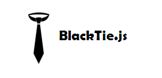
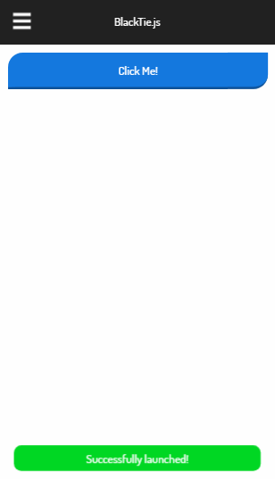

BlackTie is a framework to build *cross-platform* and *cross-device* HTML/CSS/JavaScript applications that have the look and feel of a native app. Create seamless applications with minimal effort from scratch or power your existing application by simply integrating BlackTie.js into it. Create standalone applications using just notepad or any text editor of your choice!

*Anybody can create beautiful looking applications using BlackTie.js.*

# Browser and Device Support

BlackTie aims to create applications that are compatible with all browsers and devices. Every feature in the framework is tested on multiple browsers and devices.

# Setup

For a live demo, visit [BlackTie.js](http://divakarmanivel.github.io/blacktie.js/) on desktop or mobile.

Copy all files from www/js, www/css and www/fonts to your applications www folder.
Add these lines in the head tag of index.html as:

    <head>
    ..
    <!-- BlackTie CSS -->
    <link rel="stylesheet" type="text/css" href="./css/blacktie.css" />
    <!-- Font-Family CSS -->
    <link href='./css/font-family.css' rel='stylesheet' type='text/css'>
    ..
    </head>

Add these lines before closing body tag of index.html as:

    <body>
    ..
    <!-- BlackTie -->
    
    </body>

# Usage

Initialize BlackTie and create an instance in your index.js file

    var demo = blacktie.init();

Add a div element inside the body element of index.html

    <body>
        

        ..
        //app body content goes here
        ..
        

    </body>

The following features are available in BlackTie framework

### Hamburger navigation menu

To add a hamburger menu setup BlackTie and add this code above the **container** element of index.html. It should look like this.

    <body>
        <ul id="ham-menu">
        <li class="ham-item"><a href="#">Item one</a></li>
        <li class="ham-item"><a href="#">Item two</a></li>
        <li class="ham-item"><a href="#">Item three</a></li>
        <li class="ham-item"><a href="#">Item four</a></li>
        </ul>
    
        //All other content must come under the container div element below this ul tag.
        

        ..
        //app body content goes here
        ..
        

    </body>

Then in your index.js file, call **hammenu** to initialize the Hamburger navigation.
    
    demo.hammenu();

### Debugging

Logs a message to console

    var msg = "This is a message!";
    demo.log(msg);

### UI

Shows an elegant notification message. Leave 'type' as blank for default notification

    demo.notify("This is a default notification");

    demo.notify("This is an alert notification","alert");

    demo.notify("This is an error notification","error");

    demo.notify("This is a success notification","success");

Sets the content of the containing body element

    var content = "
This is the content!</p";
    demo.setContent(content);

Sets the style of the target element. Use '#elementID' for an element with id and '.class' for elements in a class

    var style = '{"backgroundColor":"Red", "color":"White"}';
    demo.setStyle(style, "#classID");

    OR

    demo.setStyle(style, ".className");

Returns a DOM element which has star ratings (maximum 10 star rating)

    var rating = demo.createStarCard("Blacktie" ,"./images/logo.png" ,5);

Adds DOM element to containing body

    demo.addElement(rating);

Opens a page in the containing body

    var url = "./home.html";
    demo.openPage(url);

Shows a loading element

    demo.showLoading();

Hides the loading element

    demo.hideLoading();

### Network

Opens an oauth connection to a service

    var baseurl = "https://mygoogleendpoint/";
    var tokenurl = "users";
    var clientid = "my_id";
    var apikey = "my_key";
    var scope = "";
    var responsetype = "token"; //It can also be "code"
    var other = ""; //Any other payloads
    var callback = function(){};
    demo.openGoogleOauth(baseurl, tokenurl, clientid, apikey, scope, responsetype, other, callback);

Sends a get or post request

    var url = "https://myurl";
	var data = {
		date: payload
	};    
	var headers = {
		Authorization: sometokenhere
	};
    var callback = function(){};    
    demo.sendRequest(url, method, data, headers, callback);

### Storage

Stores a <key,vaue> pair to localStorage

    demo.setItem(key, value);

Gets the value for a specified key in localStorage
    
    demo.getItem(key);

Stores a <key,vaue> pair to sessionStorage
    
    demo.setVal(key, value);

Gets the value for a specified key in sessionStorage
    
    demo.getVal(key);

# Contribution

I welcome pull requests from all! Thanks in advance! For any issues visit our [Issue Template](ISSUE_TEMPLATE.md) page.

# Code of Conduct

Visit our [Code of Conduct](CODE_OF_CONDUCT.md) page for an overview on our ground rules.

# License

Created and Maintained by Divakar Manivel. Licensed under [MIT](LICENSE).
